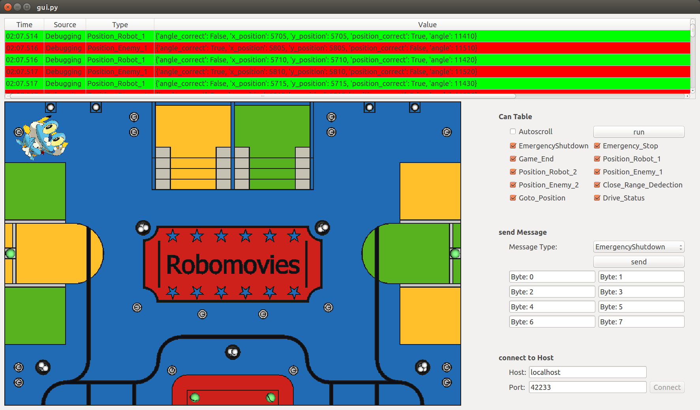

gui package
###########

This packet contains a GUI program for controlling and debugging the robot. The GUI is written with
`pyqt4 <http://pyqt.sourceforge.net/Docs/PyQt4/introduction.html>`_.

   Screenshot

The GUI has the following functions:

* Connection to the robot over ethernet. ( :py:class:`gui.communication.EditHost`,
  :py:class:`gui.gui.CanWindow.connect_host`, :py:class:`gui.communication.TcpConnection`)
* Receiving all CAN messages received by the robot and display them in a table.
  ( :py:class:`gui.communication.Table`, :py:class:`gui.communication.CanTableControl` )
* Send CAN messages from the robot. ( :py:class:`gui.communication.SendCan` )
* Show the position of each robot on a map. ( :py:class:`gui.field.GameField` )

Submodules
==========

gui.communication module
------------------------

.. automodule:: gui.communication
    :members:
    :undoc-members:
    :show-inheritance:

gui.field module
----------------

.. automodule:: gui.field
    :members:
    :undoc-members:
    :show-inheritance:

