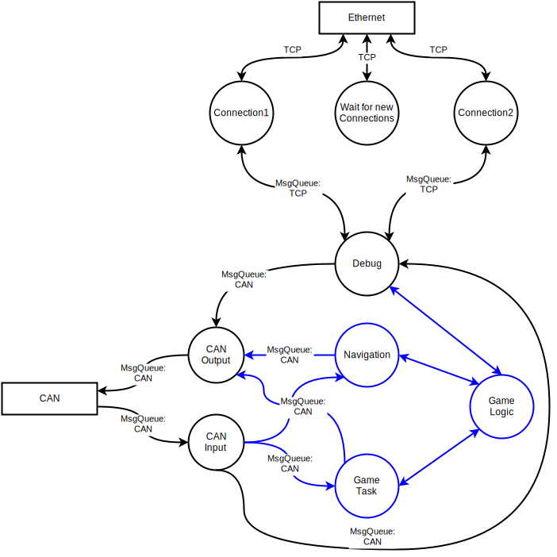

.. _hauptsteuerung-package:

hauptsteuerung package
######################

At the moment the main robot only sends all received CAN messages over tcp to the computer.
Later it will be responsible to make all game decisions.

Structure
=========

   Data Flow Diagram

Submodules
==========

hauptsteuerung_main
-------------------

For an overview of the whole package look :ref:`hauptsteuerung-package`

.. automodule:: hauptsteuerung_main
    :members:
    :undoc-members:
    :show-inheritance:

hauptsteuerung.debug module
---------------------------

.. automodule:: hauptsteuerung.debug
    :members:
    :undoc-members:
    :show-inheritance: