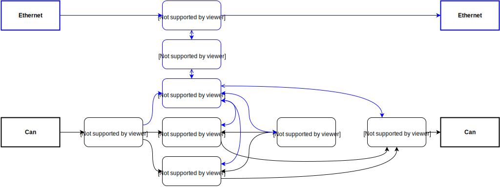

kern package
============

Structure
---------

   Processes on Robot

Submodules
----------

kern.kern module
----------------

.. automodule:: kern.kern
    :members:
    :undoc-members:
    :show-inheritance:

Module contents
---------------

.. automodule:: kern
    :members:
    :undoc-members:
    :show-inheritance:
