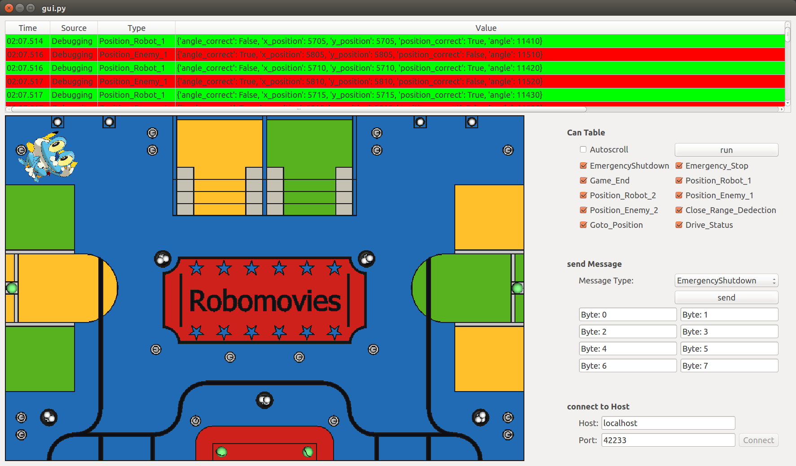
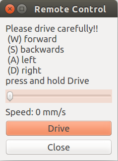
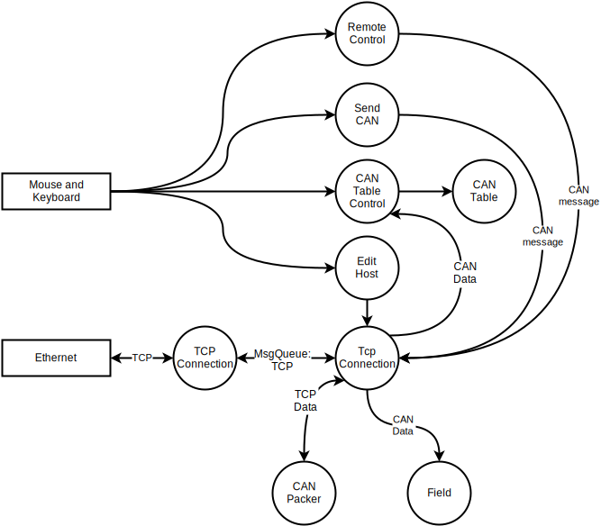

.. _laptop-package:

laptop package
##############

.. automodule:: laptop.__init__

Screenshots
===========

   Screenshot main window

   Screenshot control window

Structure
=========

The GUI is build up with multiple widgets. Each widget has its own build in functionality.
The communication between the widgets is implemented with
`QT Signal and Slots <http://qt-project.org/doc/qt-4.8/signalsandslots.html>`_.

The GUI has the following functions:

* Connection to the robot over ethernet.
    This is done with :py:class:`laptop.communication.EditHost` and :py:class:`laptop.communication.TcpConnection`.
* Receiving all CAN messages received by the robot and display them in a table.
    This is done with :py:class:`laptop.communication.CanTableControl` and :py:class:`laptop.communication.Table`.
* Send CAN messages from the robot.
    This is done with :py:class:`laptop.communication.SendCan`
* Show the position of each robot on a map.
    This is done with :py:class:`laptop.field.GameField`
* Remote control the robot.
    This is done with :py:class:`laptop.remote_control.RemoteControlWindow`.

   Data Flow Diagram

When new date arrives over tcp it first gets packed to a dictionary. Then it is send to the CAN table control which
controls which data should be displayed in the table. Then it is put in the table. At the same time the dictionary is
sent to the field widget. The field widget filters out the position data and draws it on the map.

There are 2 ways to send data. The first is to use the send can widget.
Here you can select which type of data you want to send and then manually enter it.
The second way is the remote control widget.

Submodules
==========

laptop_main module
------------------

For an overview of the whole package look :ref:`laptop-package`

.. automodule:: laptop_main
    :members:
    :undoc-members:
    :show-inheritance:
    :exclude-members: bin_, hex_, oct_

laptop.communication module
---------------------------

.. automodule:: laptop.communication
    :members:
    :undoc-members:
    :show-inheritance:
    :exclude-members: bin_, hex_, oct_

laptop.field module
-------------------

.. automodule:: laptop.field
    :members:
    :undoc-members:
    :show-inheritance:
    :exclude-members: bin_, hex_, oct_

laptop.remote_control module
----------------------------

.. automodule:: laptop.remote_control
    :members:
    :undoc-members:
    :show-inheritance:
    :exclude-members: bin_, hex_, oct_

